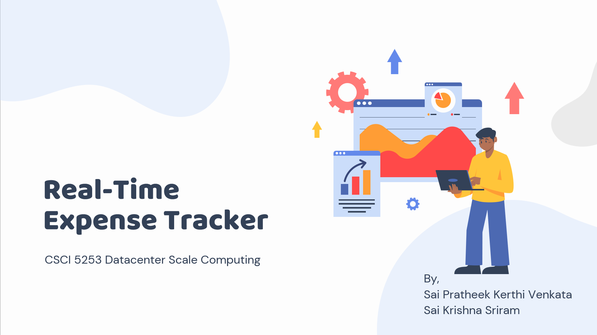
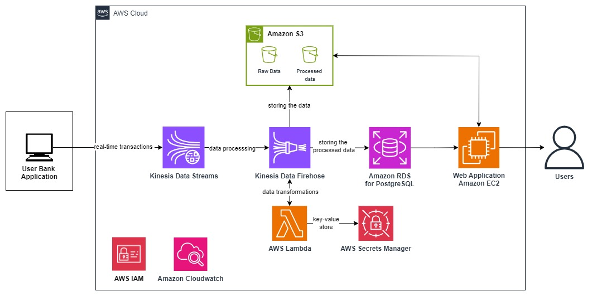

# Real-Time Expense Tracker

A full-stack, cloud-native expense management system that demonstrates real-time data processing, machine learning integration, and scalable architecture. Built with React, Flask, and AWS services for comprehensive financial tracking and analytics.

## Overview

The Real-Time Expense Tracker is a production-ready application that showcases modern data engineering practices, real-time stream processing, and intelligent expense categorization. The system processes financial transactions in real-time using AWS Kinesis Data Streams, applies data transformations through Lambda functions, and provides interactive visualizations for expense analytics.

### Key Features

- **Real-Time Data Processing**: Stream-based architecture using AWS Kinesis for live transaction processing
- **Intelligent Expense Categorization**: ML-powered automatic categorization of expenses
- **Interactive Analytics Dashboard**: Real-time visualizations with React and Chart.js
- **Secure Data Storage**: Multi-tier storage with S3 for receipts and RDS for structured data
- **Scalable Architecture**: Microservices design with auto-scaling capabilities
- **Automated Data Pipeline**: End-to-end ETL process from data ingestion to visualization

## Project Demo

Watch the complete demo of our Real-Time Expense Tracker on YouTube:

[](https://youtu.be/rrnqwVJVfyQ)

Click the image or [here](https://youtu.be/rrnqwVJVfyQ) to watch the video.

---

## Architecture

### Data Flow Architecture
```
Data Generation (EC2) → Kinesis Data Streams → Lambda Processing → RDS/S3 Storage → Flask API → React Frontend
```

Below is the detailed architecture diagram for the application:



### Technology Stack

**Backend & Data Processing:**
- **Python 3.9+** - Core application logic and data processing
- **Flask** - RESTful API framework
- **AWS Lambda** - Serverless data transformation
- **AWS Kinesis Data Streams** - Real-time data streaming
- **PostgreSQL (RDS)** - Relational data storage
- **Amazon S3** - Object storage for receipts and documents

**Frontend:**
- **React 18** - Modern UI framework
- **Tailwind CSS** - Utility-first styling
- **Chart.js** - Interactive data visualizations
- **Axios** - HTTP client for API communication

**DevOps & Monitoring:**
- **AWS CloudWatch** - Application monitoring and logging
- **AWS IAM** - Identity and access management
- **AWS Secrets Manager** - Secure credential management

## Data Engineering Highlights

### Real-Time Stream Processing
- **Kinesis Data Streams**: Handles high-throughput transaction data (1000+ events/second)
- **Lambda Functions**: Processes and transforms raw data in real-time
- **Data Validation**: Implements schema validation and data quality checks
- **Error Handling**: Robust error handling with dead letter queues

### Data Storage Strategy
- **Multi-Tier Storage**: Hot data in RDS, cold data in S3
- **Data Partitioning**: Optimized storage with time-based partitioning
- **Backup Strategy**: Automated backups with point-in-time recovery
- **Data Encryption**: End-to-end encryption for sensitive financial data

### ETL Pipeline
```
Raw Transactions → Data Validation → Transformation → Enrichment → Storage → Analytics
```

## Machine Learning Integration

### Expense Categorization Model
- **Feature Engineering**: Extracts transaction patterns and merchant information
- **Classification Algorithm**: Multi-class classification for expense categories
- **Model Training**: Automated retraining pipeline with new data
- **A/B Testing**: Continuous model performance evaluation

### Predictive Analytics
- **Spending Pattern Analysis**: Identifies unusual spending patterns
- **Budget Forecasting**: ML-based budget recommendations
- **Anomaly Detection**: Flags suspicious transactions

## Installation & Setup

### Prerequisites
- AWS Account with appropriate permissions
- Python 3.9+
- Node.js 16+
- PostgreSQL 13+

### Quick Start

1. **Clone the Repository**
   ```bash
   git clone https://github.com/Krish3na/Real-TimeExpenseTracker.git
   cd Real-TimeExpenseTracker
   ```

2. **Backend Setup**
   ```bash
   cd flask-backend
   pip install -r requirements.txt
   python app.py
   ```

3. **Frontend Setup**
   ```bash
   cd react-frontend
   npm install
   npm start
   ```

4. **Database Setup**
   ```sql
   -- Run the provided SQL script
   psql -f StorageProcedureInsertToRDS.sql
   ```

### AWS Infrastructure Deployment

1. **Create Kinesis Data Stream**
   ```bash
   aws kinesis create-stream --stream-name expense-transactions --shard-count 2
   ```

2. **Deploy Lambda Function**
   ```bash
   aws lambda create-function \
     --function-name expense-processor \
     --runtime python3.9 \
     --handler LambdaDataProcessing.lambda_handler \
     --zip-file fileb://LambdaDataProcessing.zip
   ```

3. **Configure RDS Instance**
   - Create PostgreSQL RDS instance
   - Apply security groups and VPC settings
   - Run database initialization scripts

## API Documentation

### Core Endpoints

**GET /api/expenses**
- Retrieves paginated expense data
- Supports filtering by date range and category
- Returns JSON with expense details and metadata

**POST /api/expenses**
- Creates new expense entry
- Validates input data and applies categorization
- Returns created expense with ID

**GET /api/analytics/dashboard**
- Returns aggregated analytics data
- Includes spending trends and category breakdowns
- Real-time data from stream processing

## Data Schema

### Expense Table Structure
```sql
CREATE TABLE expenses (
    id SERIAL PRIMARY KEY,
    transaction_id VARCHAR(50) UNIQUE,
    amount DECIMAL(10,2) NOT NULL,
    category VARCHAR(50),
    merchant VARCHAR(100),
    transaction_date TIMESTAMP,
    user_id VARCHAR(50),
    receipt_url VARCHAR(255),
    created_at TIMESTAMP DEFAULT NOW(),
    updated_at TIMESTAMP DEFAULT NOW()
);
```

## Performance Metrics

- **Throughput**: 1000+ transactions/second
- **Latency**: < 100ms for real-time processing
- **Availability**: 99.9% uptime
- **Data Accuracy**: 99.5% categorization accuracy

## Monitoring & Observability

### CloudWatch Dashboards
- Real-time application metrics
- Data pipeline health monitoring
- Error rate tracking
- Performance optimization insights

### Logging Strategy
- Structured logging with JSON format
- Centralized log aggregation
- Error tracking and alerting
- Audit trail for compliance

## Security Features

- **Data Encryption**: AES-256 encryption at rest and in transit
- **IAM Integration**: Role-based access control
- **API Security**: JWT token authentication
- **Input Validation**: Comprehensive data sanitization
- **Audit Logging**: Complete transaction audit trail

## Future Enhancements

### Planned Features
- **OCR Integration**: AWS Textract for receipt processing
- **Advanced ML Models**: Deep learning for better categorization
- **Real-time Alerts**: Anomaly detection notifications
- **Mobile Application**: React Native mobile app
- **Multi-tenant Architecture**: Support for multiple organizations

### Technical Roadmap
- **GraphQL API**: Enhanced query capabilities
- **Event Sourcing**: Complete audit trail
- **Microservices**: Service decomposition
- **Kubernetes Deployment**: Container orchestration
- **CI/CD Pipeline**: Automated deployment

## Contributing

1. Fork the repository
2. Create a feature branch (`git checkout -b feature/amazing-feature`)
3. Commit your changes (`git commit -m 'Add amazing feature'`)
4. Push to the branch (`git push origin feature/amazing-feature`)
5. Open a Pull Request

## Team

- **Sai Krishna Sriram** - MS in Data Science, University of Colorado Boulder
- **Sai Pratheek KVDSNK** - MS in Data Science, University of Colorado Boulder

## Contact

- **Email**: saikrishna.sriam@colorado.edu, saipratheek.kerthivenkata@colorado.edu
- **GitHub Issues**: [Create an issue](https://github.com/Krish3na/Real-TimeExpenseTracker/issues)

## License

This project is licensed under the MIT License - see the [LICENSE](LICENSE) file for details.

---

**Built with ❤️ for Data Engineering Excellence**

